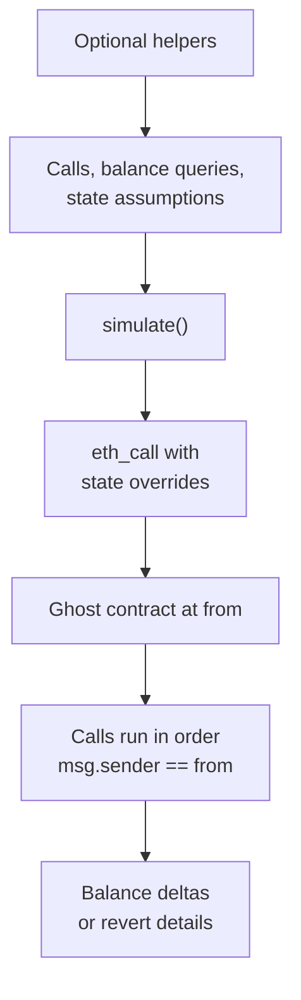

# viem-tx-sim

Preview transaction and batch balance changes with viem over JSON-RPC, without a local fork or simulation API.

[](https://www.npmjs.com/package/viem-tx-sim)
[](https://github.com/frontier159/viem-tx-sim/actions/workflows/ci.yml)
[](./LICENSE)

Pass your viem `PublicClient`, sender, and calldata to preview native and token balance changes before signing. Use the same API for one transaction or an ordered batch.

> [!IMPORTANT]
> A simulation previews one RPC state snapshot. The signed transaction may execute against different state. Contracts can observe the injected code at `from`, so do not use the result as a security boundary.

## Before you install

- **Runtime:** Node.js 20 or newer, ESM, and `viem` 2.8 or newer.
- **RPC:** Requires `eth_call` with state overrides, and `eth_createAccessList` for discovery. Some RPC providers omit access lists when a probed call reverts.
- **Scope:** Caller receives raw balance changes and reverts. Client handles token metadata, prices, gas estimation, transaction assembly, and permit signing.

## Install

```sh
pnpm add viem-tx-sim viem
```

## Quick start

Use the viem client, sender, and calls from your application. List the balances you want to observe:

```ts
import { TxSimulator } from "viem-tx-sim";

const simulator = TxSimulator.create({ client });

const result = await simulator.simulate({
  from,
  calls,
  balanceQueries: [
    { asset: "native", account: from },
    { asset: tokenAddress, account: from },
    { asset: tokenAddress, account: recipient },
  ],
});

if (result.status === "reverted") {
  console.error(result.failingCallIndex, result.revertReason);
} else {
  console.table(result.balanceDeltas);
}
```

For a transfer of 250 token units, the table would contain:

| asset | account | before | after | delta | byCall |
| --- | --- | ---: | ---: | ---: | --- |
| `0xToken…` | `from` | `1000n` | `750n` | `-250n` | `[-250n]` |
| `0xToken…` | `recipient` | `10n` | `260n` | `250n` | `[250n]` |

Each balance delta contains `before`, `after`, `delta`, and `byCall`. `delta` is `after - before`; `byCall[i]` is the change caused by `calls[i]`. `result.unresolved` contains unreadable queries.

See [examples](./docs/examples/) for discovery, sequential batches, unfunded accounts, and revert handling.

## Choose your workflow

`simulate()` takes calls, balance queries, and optional state assumptions. It sends one `eth_call`. Call helper methods for discovery.

| Goal | Use | Example |
| --- | --- | --- |
| Observe known balances | `simulate()` with `balanceQueries` | [Known balances](./docs/examples/known-balances.md) |
| Discover the sender's touched ERC-20 balances | `balanceQueries.forUser()` | [Balance discovery](./docs/examples/discover-balances.md) |
| Simulate approve-then-use or another ordered batch | `simulate()` with multiple calls | [Sequential batch](./docs/examples/sequential-batch.md) |
| Preview an unfunded or view-only account | `tokenOverrides.*` or `nativeBalanceOverrides` | [Unfunded account](./docs/examples/unfunded-account.md) |
| Decode reverts or inspect RPC activity | `errorAbi` and `debug` | [Reverts and debugging](./docs/examples/reverts-and-debugging.md) |

## How it works



During `eth_call`, the package injects the runtime bytecode of a never-deployed **ghost contract** at `from`.

Downstream contracts see `msg.sender == from`. Calls run in order within one EVM context. The ghost contract records balance checkpoints before and after each call, then returns total and per-call changes. `eth_call` writes no state onchain.

The optional helpers prepare two kinds of explicit input:

- `balanceQueries.*` discovers balances to observe.
- `tokenOverrides.*` verifies storage slots or estimates required balances and allowances.

## Results and errors

Both successful and reverted simulations return `balanceDeltas` and `unresolved`. A reverted result includes `failingCallIndex` and `revertData`. Successful decoding adds `revertSelector`, `revertReason`, and `revertError`.

Transaction reverts are results. Infrastructure and invalid-input failures throw typed errors:

- `AccessListUnsupportedError`: the RPC endpoint cannot create access lists.
- `StateOverrideUnsupportedError`: the RPC endpoint rejected state overrides or returned invalid simulator data.
- `InvalidSimulationInputError`: the caller supplied invalid input, such as an empty batch.

RPC providers and contracts control parts of error messages and `revertReason`. Treat that text as untrusted before rendering it in a UI.

## Limitations

- A simulation reads one RPC state snapshot. Pending transactions, later blocks, and builder behavior can change the outcome before the signed transaction lands.
- `balanceQueries.forUser()` derives candidates from `eth_createAccessList`. If the RPC provider returns a revert without an access list, the helper may miss addresses touched later in the call. Supply balance queries when you know the assets. When the provider rejects the access list because `from` cannot fund the calls, discovery degrades to the direct call targets rather than throwing (direct transfers still discovered; intermediary tokens may be missed).
- Balance queries read native balances or `balanceOf(address)`. The library does not model token-ID ownership or ERC-1155 balances by ID.
- NFT capture (`nftQueries`) reports ERC-721/1155 tokens **received** by `from` during simulation — via receiver callbacks (safe transfers, `_safeMint`) and an ERC-721 Enumerable walk (plain `_mint` on Enumerable collections such as Uniswap V3 positions). It does **not** detect: NFTs *sent* by `from`; counter-based mints that are neither safe nor Enumerable (e.g. Uniswap V4 positions — planned); plain-`_mint` non-Enumerable ERC-721s; or general ERC-1155 balances. Captured `tokenUri` reflects **post-simulation** state and is best-effort under a gas budget — heavy on-chain renderers may return undefined.
- Injecting code at `from` changes code-size and account-type checks. The ghost contract handles ERC-1271 and common NFT receiver flows. Contracts with other EOA-versus-contract branches may choose another path during simulation.
- Storage overrides require a verified balance or allowance slot. The helper puts non-standard or indirect layouts in `unresolved` and leaves their state unchanged.
- Supply signed permit calldata. Your application creates and signs permits.
- `tokenSlotOverrides` amounts must be below `uint256.max`. Use `OVERRIDE_TOKEN_AMOUNT` when you construct overrides so allowance decrements and incoming transfers remain observable.

To pin a multi-step workflow, pass the same fixed `blockNumber` to every discovery, preparation, and `simulate()` call. A moving tag such as `latest` can resolve to a different block on each RPC request.

## Public API

- `TxSimulator.create({ client, gas?, debug?, errorAbi? })`
- `simulate({ from, calls, balanceQueries, … })`
- `balanceQueries.forUser()` and `balanceQueries.discoverErc20s()`
- `tokenOverrides.forBalances()` and `tokenOverrides.forAllowances()`
- `tokenOverrides.estimateRequirements()`
- `DEFAULT_SIMULATION_GAS_LIMIT` and `OVERRIDE_TOKEN_AMOUNT`

The package exports its public argument/result types and typed error classes. TypeScript declarations are the detailed reference.

## Development

Use Node.js 20+, pnpm 10, and Foundry nightly `nightly-7debd6d47628c5551837534aee507dbf552d5889`.

Foundry v1.7.1 lacks the access-list-on-revert behavior required by the test suite. Replace the nightly pin with the first stable release newer than v1.7.1.

```sh
foundryup --install nightly-7debd6d47628c5551837534aee507dbf552d5889
pnpm install
pnpm verify
```

`pnpm verify` runs formatting checks, linting, typechecking, the build, and the test suite. The test suite starts isolated local EVM nodes. After changing the contract, run `pnpm build:contracts` to regenerate `src/generated/txSimulatorBytecode.ts`. Do not edit generated bytecode by hand.

Run the mainnet tests with an RPC URL:

```sh
MAINNET_RPC_URL=https://your-rpc.example pnpm test:mainnet
```

## Support and contributing

Use [GitHub Issues](https://github.com/frontier159/viem-tx-sim/issues) for usage questions, reproducible bugs, provider compatibility reports, and focused proposals. Pull requests should include relevant tests and pass `pnpm verify`.

Report vulnerabilities through [GitHub's private vulnerability form](https://github.com/frontier159/viem-tx-sim/security/advisories/new). If the form is unavailable, open an issue requesting a private contact channel without including technical details.

See the [changelog](./CHANGELOG.md) for released changes.

## Credits

[Apoorv Lathey's transaction-simulation thread](https://x.com/apoorveth/status/2041544070481449266) inspired the ghost-contract approach. Read [docs/motivation.md](./docs/motivation.md) for the original design notes and diagrams.

## License

[MIT](./LICENSE) © 2026 frontier159
