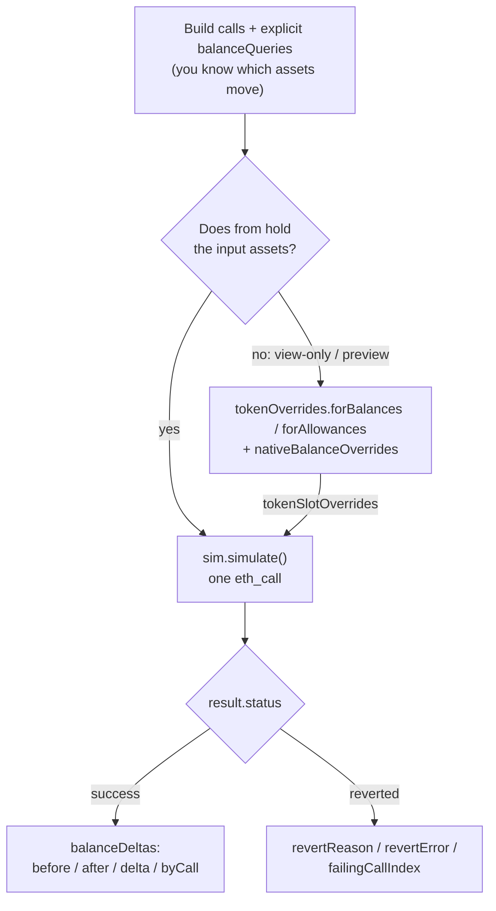
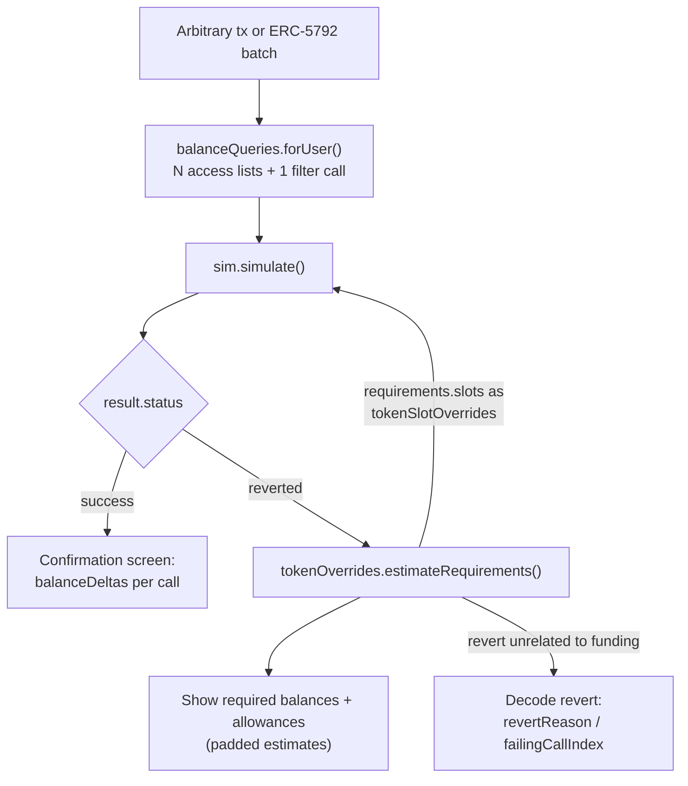

# viem-tx-sim

Preview a transaction's or ERC-5792 batch's asset changes before anyone signs, using nothing but standard JSON-RPC.

`viem-tx-sim` injects a never-deployed ghost contract at the user's own address via `eth_call` state overrides, so every downstream contract sees the real `msg.sender` — balance reads, allowance checks, and `msg.sender`-gated logic behave exactly as they would in the real transaction. It is RPC-only: no token lists, no indexers, no centralized simulation APIs, and [viem](https://viem.sh) is the only runtime dependency. Batch calls execute sequentially inside one EVM context, so an approval in call 1 is visible to a swap in call 2, and the core simulation is a single `eth_call` when you already know what to observe.

Who it's for:

1. **Dapps** — preview the flows you already know before prompting a signature: you know the contracts involved, so one `eth_call` with explicit `balanceQueries` shows the user exactly what a swap or deposit will move, `tokenOverrides.estimateRequirements()` tells them what balance or allowance they're missing before they hit a revert, and any address can be simulated — including view-only or impersonated accounts, no key involved.
2. **Wallets** — render an "asset changes" confirmation screen for arbitrary incoming transactions and ERC-5792 batches: `balanceQueries.forUser()` discovers which assets a call touches with no token lists, indexers, or centralized simulation APIs, and because the simulation runs with the real `msg.sender`, approval- and permit-gated flows preview the way they will execute.

Before adopting, know three things:

- **RPC requirements.** `sim.simulate()` needs `eth_call` with state overrides. The discovery and override helpers (`balanceQueries.forUser()`, `balanceQueries.discoverErc20s()`, `tokenOverrides.*`) additionally need `eth_createAccessList`, including access lists returned for reverting calls. Missing support surfaces as `StateOverrideUnsupportedError` / `AccessListUnsupportedError`.
- **A simulation is a preview, not a guarantee.** Results reflect one block's state, and an adversarial contract can detect the simulation and behave differently on-chain. See [Known limitations](#known-limitations).
- **Pre-1.0.** Minor versions may include breaking changes until 1.0.0.

## Install

```sh
pnpm add viem-tx-sim viem
# or
npm install viem-tx-sim viem
```

The package is ESM-only (no CommonJS build) and requires Node 20 or newer. `viem` (2.x) is a peer dependency, so install it alongside `viem-tx-sim` as shown above.

Pre-release consumers can install from git with `pnpm add github:frontier159/viem-tx-sim`; the `prepare` script builds `dist/` with `tsc` from committed contract bytecode, so Foundry is not needed at install time.

## Quick start

Simulate depositing 1,000 USDS into the sUSDS ERC-4626 vault on mainnet — an approve followed by a deposit, as one atomic batch:

```ts
import { createPublicClient, encodeFunctionData, http, parseAbi, parseUnits } from "viem";
import { mainnet } from "viem/chains";
import { DEFAULT_SIMULATION_GAS_LIMIT, TxSimulator } from "viem-tx-sim";

const USDS = "0xdC035D45d973E3EC169d2276DDab16f1e407384F";
const SUSDS = "0xa3931d71877C0E7a3148CB7Eb4463524FEc27fbD";

const client = createPublicClient({ chain: mainnet, transport: http(RPC_URL) });
const sim = TxSimulator.create({ client, gas: DEFAULT_SIMULATION_GAS_LIMIT });

const user = "0xYourAddress"; // no key or signing involved — any address can be simulated
const assets = parseUnits("1000", 18);

const calls = [
  {
    to: USDS,
    data: encodeFunctionData({
      abi: parseAbi(["function approve(address spender, uint256 amount) returns (bool)"]),
      functionName: "approve",
      args: [SUSDS, assets],
    }),
  },
  {
    to: SUSDS,
    data: encodeFunctionData({
      abi: parseAbi(["function deposit(uint256 assets, address receiver) returns (uint256 shares)"]),
      functionName: "deposit",
      args: [assets, user],
    }),
  },
];
const balanceQueries = await sim.balanceQueries.forUser({ from: user, calls });
const result = await sim.simulate({
  from: user,
  calls,
  balanceQueries,
});

console.log(result.status); // "success"
console.log(result.balanceDeltas);
// [
//   { asset: "native", account: user, before: 1n..., after: 1n..., delta: 0n, byCall: [0n, 0n] },
//   { asset: "0xdC03...384F", account: user, before: 1000n..., after: 0n, delta: -1000n..., byCall: [0n, -1000n...] },
//   { asset: "0xa393...7fbD", account: user, before: 0n, after: 9xx...n, delta: 9xx...n, byCall: [0n, 9xx...n] },
// ]
```

`balanceDeltas` mirror your `balanceQueries` in order, including zero deltas, with raw `bigint` amounts in each asset's own units. `byCall` is index-aligned with `calls`, sums to `delta`, and entries from a failing call onward are `0n` on a returned revert. A revert is returned as `status: "reverted"`, never thrown; checking `status` gives typed access to `revertData` and `failingCallIndex`.

`sim.simulate()` observes only the balances you ask for and does not retry or forge state by itself. If `user` doesn't actually hold 1,000 USDS (say you're previewing for a view-only address), prepare and pass a balance override — see [Balance and allowance overrides](#balance-and-allowance-overrides). `DEFAULT_SIMULATION_GAS_LIMIT` is exported for callers that want to pass or display the default 16M simulation gas budget.

## How it works

Every wallet shows "asset changes" before you sign. Most do it by sending your data to a centralized simulation API — a single point of failure and a privacy leak. `viem-tx-sim` makes the EVM do the work itself: one `eth_call` with state overrides places the `TxSimulator` ghost contract at `from`, so `address(this)` and `msg.sender` are the real account while the calls execute and balances are checkpointed around each one. Zero servers, zero trust assumptions.

The mental model: everything passed to `sim.simulate()` is explicit. `calls` are what executes, `balanceQueries` are what you observe, and `tokenSlotOverrides` / `nativeBalanceOverrides` are the state assumptions you want to forge. `simulate()` does not discover tokens, retry, or forge balances by itself — the helper namespaces only build those data inputs: `balanceQueries.*` builds observations, and `tokenOverrides.*` builds token assumptions.

The design comes from the [apoorv X thread](https://x.com/apoorveth/status/2041544070481449266), transcribed in [docs/motivation.md](https://github.com/frontier159/viem-tx-sim/blob/main/docs/motivation.md) — including how Permit2's ERC-1271 path and proxy-token storage are handled.

Scope is deliberately narrow: the library returns explicit raw balance observations only. Token metadata, token lists, indexers, centralized simulation APIs, approval UX, and price enrichment are intentionally out of scope. The library never constructs or signs permits or EIP-712 payloads; callers bring fully signed calldata, and already-signed permit calls simulate as ordinary calls.

## API at a glance

```ts
const sim = TxSimulator.create({ client, gas, debug, errorAbi });

const result = await sim.simulate({
  from,
  calls, // SimulatedCall[]
  balanceQueries, // BalanceQuery[]
  tokenSlotOverrides, // TokenSlotOverride[] | undefined
  nativeBalanceOverrides, // NativeBalanceOverride[] | undefined
  gas,
  debug,
  errorAbi,
  blockNumber,
  blockTag,
});
// success -> { status: "success", balanceDeltas, unresolved }
// reverted -> success fields + { revertData, failingCallIndex, revertSelector?, revertReason?, revertError? }

await sim.balanceQueries.forUser({ from, calls }); // BalanceQuery[]
await sim.balanceQueries.discoverErc20s({ from, calls }); // Address[]
await sim.tokenOverrides.forBalances({ from, tokens }); // PreparedBalanceOverrides
await sim.tokenOverrides.forAllowances({ from, pairs }); // PreparedAllowanceOverrides
await sim.tokenOverrides.estimateRequirements({ from, calls }); // EstimatedAssetRequirements

// Exports: DEFAULT_SIMULATION_GAS_LIMIT, OVERRIDE_TOKEN_AMOUNT, TxSimError,
// AccessListUnsupportedError, StateOverrideUnsupportedError, InvalidSimulationInputError.
```

## Simulation flows

### Dapp flow — you know the calls and the assets

Explicit queries, no discovery, one `eth_call`. Overrides only when previewing for an address that doesn't hold the inputs yet:



### Wallet flow — arbitrary calls arrive

Discovery first, and `estimateRequirements()` when a revert (or a funding question) needs answering:



The loop back into `sim.simulate()` is the underfunded-preview trick: forge the missing balances and allowances, then show the user what the batch *would* do once funded and approved.

## Choosing what to observe

`sim.balanceQueries.forUser()` is the wallet-style discovery helper: it dry-runs each call with `eth_createAccessList`, filters touched contracts into token balance queries with one simulator call, and returns native plus token queries for `from` — no token lists or indexers. For an N-call batch, the full wallet flow is N access lists + one token-filter call + one simulation. `sim.balanceQueries.discoverErc20s()` exposes just the filtered token list when you want to map queries yourself.

If your dapp already knows what it needs to inspect, skip discovery and pass explicit queries. These can observe any account, not just `from`:

```ts
const balanceQueries = tokens.map((asset) => ({ asset, account: pluginAddress }));
const result = await sim.simulate({
  from: user,
  calls: partialBundle,
  balanceQueries,
});
const leftoverAfterZap = result.balanceDeltas.find(
  (delta) => delta.asset === flashToken && delta.account === pluginAddress,
)?.byCall[0];
```

## Balance and allowance overrides

Override preparation is explicit and cacheable. Preparation returns ready-to-use `TokenSlotOverride[]` entries, so pass them into a single simulation run:

```ts
import { TxSimulator } from "viem-tx-sim";

const sim = TxSimulator.create({ client });
const balanceOverrides = await sim.tokenOverrides.forBalances({
  from,
  tokens: [token],
});
const allowanceOverrides = await sim.tokenOverrides.forAllowances({
  from,
  pairs: [{ token, spender }],
});

const result = await sim.simulate({
  from,
  calls: [{ to, data }],
  balanceQueries: [{ asset: token, account: from }],
  tokenSlotOverrides: [...balanceOverrides.slots, ...allowanceOverrides.slots],
});
```

Prepared balance overrides are reusable per token/owner, and prepared allowance overrides are reusable per token/owner/spender for the block/state you trust. Preparation pre-sets `amount` to the exported `OVERRIDE_TOKEN_AMOUNT` sentinel, a non-max `10^50` value chosen so standard ERC-20 allowance decrements remain observable. Handcrafted override amounts must be below `uint256.max`; max allowance skips decrements, and max balances can overflow on incoming transfers. Deltas for real holdings still work for rebasing tokens like stETH; only dealing hypothetical balances can fail, reported in `unresolved`.

Query the token or native accounts you forge if you want to observe them.

For approvals, either include an `approve` / `permit` call in `calls` so later calls see it, or use `sim.tokenOverrides.forAllowances()` when you need to simulate already-approved state without sending an approval call.

## Native balance overrides

Native balances do not need preparation or slot discovery. Set them directly with `nativeBalanceOverrides`, for `from` or any other account:

```ts
const result = await sim.simulate({
  from,
  calls,
  balanceQueries: [{ asset: "native", account: from }],
  nativeBalanceOverrides: [{ account: from, amount: OVERRIDE_TOKEN_AMOUNT }],
});
```

## Estimating asset requirements

When you don't already know which balances and approvals a transaction needs, `sim.tokenOverrides.estimateRequirements()` measures them by forging generous state and observing per-call balance and allowance changes. It also forges native balance for `from`, so native zap-in routes from unfunded wallets report `requirements.native` instead of failing as a route error. Returned amounts are estimates measured under forged state and should be padded; pairs whose allowance is set inside the batch (approve or permit) are excluded, and measured allowance decreases are sanity-bounded by the token's gross outflow. Measurements discarded by that bound are reported under `unresolved.allowances`.

```ts
import { TxSimulator } from "viem-tx-sim";

const sim = TxSimulator.create({ client });
const requirements = await sim.tokenOverrides.estimateRequirements({ from, calls });
// requirements.allowances -> [{ token, spender, amount }]
// requirements.balances   -> [{ token, amount }]
// requirements.slots      -> feed to sim.simulate({ ..., tokenSlotOverrides })

const result = await sim.simulate({
  from,
  calls,
  balanceQueries: await sim.balanceQueries.forUser({ from, calls }),
  tokenSlotOverrides: requirements.slots,
});
```

## Batches (ERC-5792)

`calls` accepts one call or an ERC-5792-style sequential batch, executed inside a single EVM context by one `eth_call` — state changes from earlier calls are visible to later calls, as the [quick start](#quick-start) shows with approve-then-deposit. Per-call attribution comes back in `byCall` on each `BalanceDelta`, index-aligned with `calls`; on a revert, `failingCallIndex` identifies the failing call and `byCall` entries from that call onward are `0n`.

## Decoding reverts

Reverted simulations always return raw `revertData` and, when present, a `revertSelector`. Pass custom errors as `errorAbi` on `TxSimulator.create({ client, errorAbi })` or on a single `sim.simulate({ ..., errorAbi })` call to populate `revertError` and human-readable `revertReason`. For example: `errorAbi: parseAbi(["error InsufficientBalance(uint256 have, uint256 want)"])`. `revertReason`, `revertError` args, and thrown error messages embed text controlled by the simulated contracts and the RPC provider — treat them as untrusted display data, not instructions.

## Debugging

Set `VIEM_TX_SIM_DEBUG_RPC=1` to log RPC debug events to the console without touching call sites. In code, pass `debug: true` (on `TxSimulator.create` or per call) for console logging, or a callback to collect structured events:

```ts
await sim.simulate({
  from,
  calls: [{ to, data }],
  balanceQueries: [],
  debug: (event) => {
    console.debug(event.method, event.step, event.phase, event.durationMs);
  },
});
```

## Known limitations

Situations the simulation does not cover, or where the preview can differ from real execution. None of these throw — they show up as wrong or missing deltas, or as a simulated revert where the real transaction would succeed (or vice versa).

**The account has code during simulation.** Injecting `TxSimulator` at `from` is the core trick, and it is visible on-chain logic:

- Contracts that gate on "is the caller an EOA" via `extcodesize(msg.sender) == 0` see a contract during simulation and may take a different branch than the real transaction.
- Receiving ERC-721/1155 tokens via `safeTransferFrom`/`safeMint` succeeds: `TxSimulator` implements `onERC721Received`, `onERC1155Received`, and `onERC1155BatchReceived`, so safe transfers into the simulated account match real execution for EOAs and contract wallets.
- ERC-777 `send` to the simulated account reverts unless the account has a real ERC-1820 registration on-chain.
- Permit2-style signature checks are handled for EOAs: the injected `isValidSignature` performs the same ECDSA recovery the real `ecrecover` path would.

**Smart-contract wallets (e.g. a Gnosis Safe) are treated as plain senders.** Using a Safe as `from` works: the code override replaces the wallet's bytecode but keeps its storage, ETH, and token balances, and every call executes with `msg.sender` = the wallet. What is *not* modeled is the wallet itself:

- The injected `isValidSignature` **replaces the wallet's own ERC-1271 validation** and only accepts EOA-style signatures recovering to `from`. Flows that require the wallet's real contract-signature logic (Permit2 permits or orders signed by the Safe itself) simulate as reverted. This is intentional — the goal is simulating downstream protocol behavior, not the wallet's signing machinery.
- Guards, modules, owner thresholds, nonces, and `operation=DELEGATECALL` batches are outside the simulation. A transaction guard that would block the real execution is invisible to the preview.
- `tx.origin` is the `from` address during simulation; in real execution it is the submitting EOA.

**An adversarial contract can detect it is being simulated** — via the code at `from`, the recognizable forged balances, or `eth_call` context — and behave differently in the real transaction. This is inherent to state-override simulation (centralized simulation APIs share it). Treat the preview as best-effort insight, not a security guarantee against malicious contracts.

**Results are estimates against one block's state.** Deltas and estimated asset requirements reflect the chosen block; prices, liquidity, and allowances move before the real transaction lands. Pad amounts accordingly. Amounts from `sim.tokenOverrides.estimateRequirements()` are additionally measured under forged (very large) balances, so contracts that branch on the account's real balance can be measured on the wrong branch.

**Asset coverage is native + `balanceOf(address)`.** Deltas track ETH and anything answering ERC-20-style `balanceOf` (an ERC-721 shows up as a count delta, without token IDs). ERC-1155 balances (`balanceOf(address,uint256)`) are not tracked. Tokens whose balance is computed rather than stored in one slot per holder (rebasing/share-based tokens like stETH) cannot be forged — override preparation verifies slots before writing and reports them in the `unresolved` list.

**Wallet discovery follows the dry run.** `sim.balanceQueries.forUser()` token candidates come from `eth_createAccessList` on the *unforged* calls; if that dry run reverts early, contracts that would only be touched later are not discovered. Explicit `balanceQueries` avoid this when your app already knows the assets or accounts to observe.

**RPC provider requirements.** `sim.simulate()` requires `eth_call` with state overrides. `sim.balanceQueries.forUser()`, `sim.balanceQueries.discoverErc20s()`, `sim.tokenOverrides.*`, and asset-requirement estimation also require `eth_createAccessList` (including returning the access list for reverting calls). Missing support surfaces as `AccessListUnsupportedError` / `StateOverrideUnsupportedError`.

**Not a gas estimator.** The simulation runs under `DEFAULT_SIMULATION_GAS_LIMIT` by default and the injected code changes gas accounting; use `eth_estimateGas` on the real transaction for gas.

## Development

Use Node.js 20 or newer with pnpm 10. With `proto`:

```sh
proto use pnpm 10.18.3 --pin
pnpm install
```

Or, if your Node installation has Corepack:

```sh
corepack enable
corepack prepare pnpm@10.18.3 --activate
pnpm install
```

If your version manager still selects pnpm 11 under Node 20, either switch pnpm to 10 or switch Node to 22.13+.

Building and testing requires [Foundry](https://getfoundry.sh) (`forge` compiles `TxSimulator.sol`, `anvil` backs the test suite). Foundry nightly is expected, because local access-list-on-revert behavior must match production RPCs. CI pins `nightly-7debd6d47628c5551837534aee507dbf552d5889` (Anvil access-list-on-revert behavior needs [foundry-rs/foundry#14569](https://github.com/foundry-rs/foundry/pull/14569), not yet in a stable release); install it with `foundryup --install nightly-7debd6d47628c5551837534aee507dbf552d5889` if the suite's access-list tests fail on your local Foundry.

```sh
pnpm build
pnpm test
```

Run `pnpm verify` to execute the full local gate that CI runs: lint, typecheck, build, and tests. For a tight inner loop, `pnpm build:contracts && pnpm exec vitest run test/simulate.test.ts` runs one suite without the full gate.

To see every RPC call the simulator makes during tests:

```sh
pnpm test:debug
```

To run the opt-in mainnet RPC integration test:

```sh
MAINNET_RPC_URL=$MAINNET_RPC_URL pnpm test:mainnet
```

Set `MAINNET_BLOCK_NUMBER` to override the pinned default block.

## License

[MIT](https://github.com/frontier159/viem-tx-sim/blob/main/LICENSE) © frontier159
