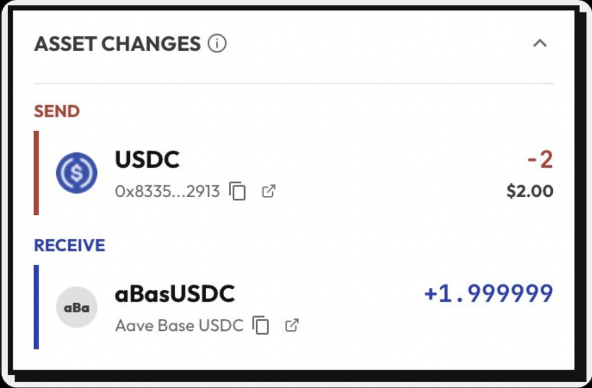
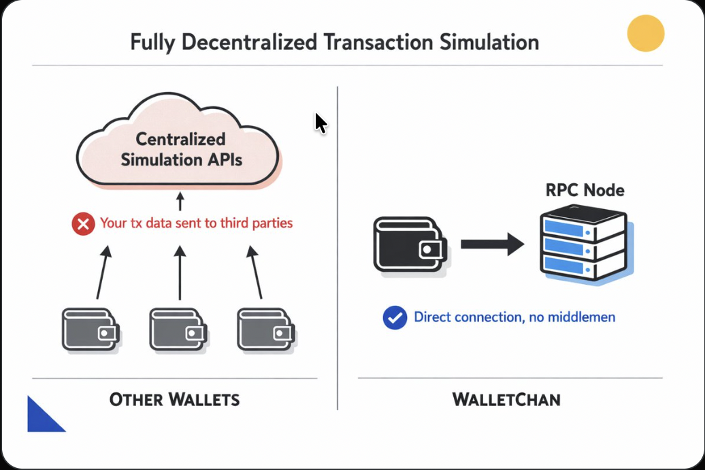
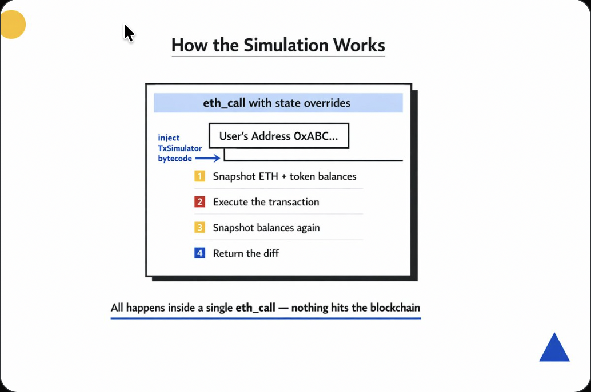
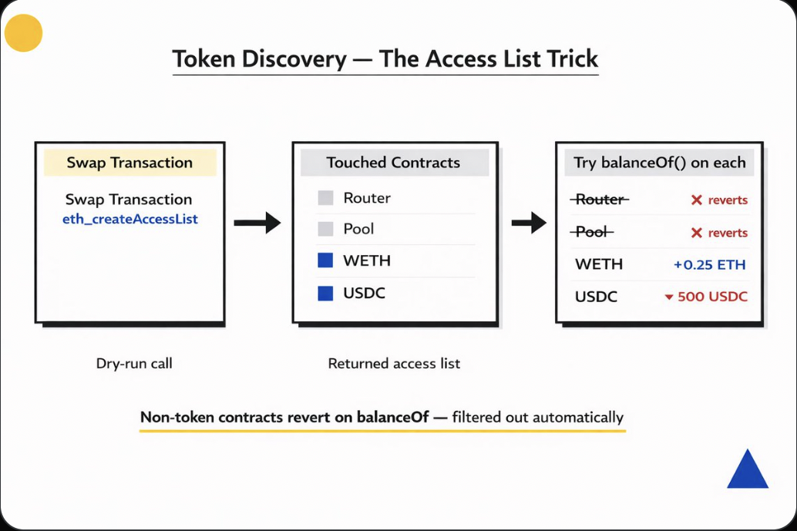
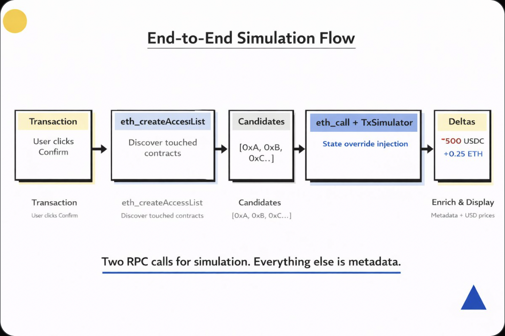
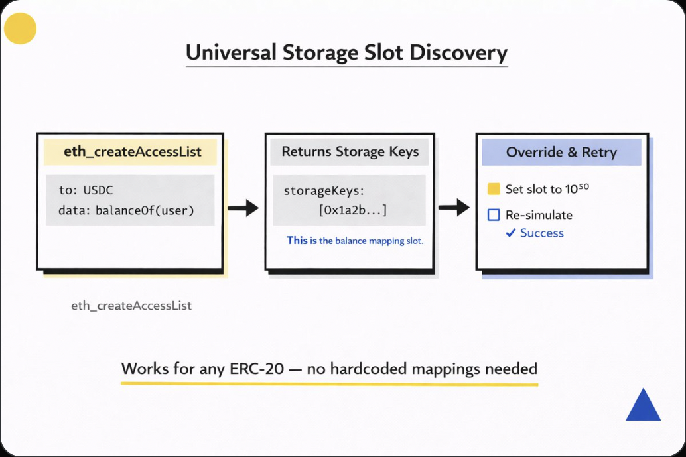
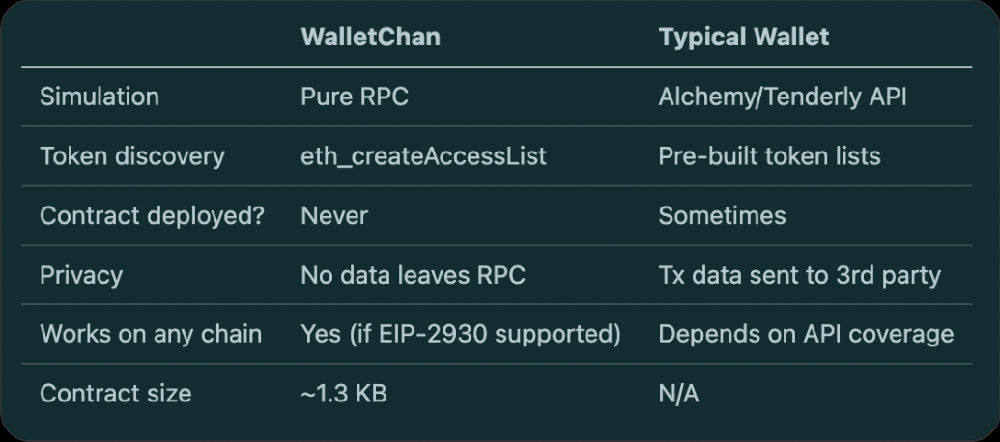

# Motivation

This document transcribes the [apoorv X thread](https://x.com/apoorveth/status/2041544070481449266) that motivated this package.

> **Historical note**: this thread describes the original design, in which
> the simulator retried automatically with forged balances and allowances
> (post 9). The shipped library made that explicit instead: `simulate()` is
> a single pass; callers opt into forging via `prepareBalanceOverrides()`,
> `prepareAllowanceOverrides()`, or `estimateAssetRequirements()`. See the README.

## Post

Every wallet shows you "asset changes" before you sign a transaction.

Most of them call a centralized API to do it.

We don't. Here's how `@WalletChan_` simulates every transaction using nothing but raw RPC calls and a ghost contract that never exists onchain.



When a dapp asks you to swap 1 ETH for USDC, you want to know EXACTLY what leaves and what arrives.

The standard approach? Send the calldata to a third-party API, trust their servers to simulate it, and hope they return accurate results.

That's a single point of failure. And a privacy leak.



Our approach: make the EVM do the work itself.

We wrote a Solidity contract called `TxSimulator.sol` - but we never deploy it.

Instead, we inject its bytecode into the user's address using `eth_call` state overrides and run the entire simulation in one atomic RPC call.

Zero servers. Zero trust assumptions. Just the EVM.



This is where it gets fun.

By placing the simulator AT the user's address:

- `address(this)` == user's address, so `balanceOf(address(this))` returns the user's REAL token balances
- When it calls `to.call{value}(data)`, the target contract sees `msg.sender` == user's address

The simulation is indistinguishable from the real transaction. No impersonation tricks needed.

But how do we know WHICH tokens to check?

Most wallets maintain giant token lists or query indexer APIs.

We use a single RPC call: `eth_createAccessList`

It dry-runs the transaction and returns every contract address + storage slot that was touched. For a Uniswap swap, that includes the router, pool, WETH, USDC - everything.

These become our "candidate" tokens.



The `TxSimulator.sol` contract is ~60 lines of Solidity.

Non-token addresses (routers, pools) just revert on `balanceOf`; `_tryBalanceOf` catches that and returns 0. They get filtered out automatically.

```solidity
function simulate(
    address to,
    uint256 value,
    bytes calldata data,
    address[] calldata candidates
) external returns (
    bool success,
    int256 ethDelta,
    address[] memory tokens,
    int256[] memory deltas
) {
    // 1. Snapshot ETH + token balances
    uint256 ethBefore = address(this).balance;
    for (uint i; i < candidates.length; ++i)
        before[i] = _tryBalanceOf(candidates[i]);

    // 2. Execute the actual transaction
    (success, ) = to.call{value: value}(data);

    // 3. Compute deltas, return only non-zero
    ethDelta = int256(address(this).balance) - int256(ethBefore);
    // ... filter and return token deltas
}
```

Putting it all together - when you click "Confirm" on a transaction in WalletChan:

Step 1: `eth_createAccessList` - discover all touched contracts

Step 2: `eth_call` with state override - inject TxSimulator at user's address, pass candidates, get balance deltas

Step 3: Enrich metadata - token list lookup + on-chain multicall for name/symbol/decimals

Step 4: Fetch USD prices - CoinGecko with portfolio fallback

Two RPC calls for the simulation itself. Everything else is metadata.



There's a subtle problem: Permit2 checks `extcodesize(msg.sender)`.

Since we injected code at the user's address, Permit2 sees code and calls `isValidSignature` (ERC-1271) instead of using `ecrecover`.

Our fix: TxSimulator implements `isValidSignature` that does the ECDSA recovery internally.

Permit2 calls our function, we do the same ECDSA check it would have done, and the simulation proceeds correctly.

```solidity
function isValidSignature(
    bytes32 hash,
    bytes calldata signature
) external pure returns (bytes4) {
    // extract r, s, v from signature
    // ecrecover and verify
    return 0x1626ba7e; // ERC-1271 magic value
}
```

What if the simulation reverts because the user doesn't have enough tokens? (common for impersonated/view-only accounts)

We retry with "storage slot overrides" - and here's the trick to find the right slots:

Call `eth_createAccessList` on `balanceOf(user)` for each token. The access list tells us EXACTLY which storage slot holds the balance mapping.

Then we override that slot with a large balance and re-simulate. Works for any ERC-20 implementation - OpenZeppelin, USDC proxy, custom, whatever.



ERC-5792 batch transactions add another twist: the wallet sends multiple calls as a batch (approve + swap, for example).

Normal `simulate()` can't handle this because state changes need to persist between calls.

`TxSimulator.sol` has a `simulateBatch()` function that executes all calls sequentially in a single EVM execution context. The approval from call 1 is visible to the swap in call 2.

One `eth_call`. Multiple transactions. Cumulative deltas.

How does this compare to other wallets?


