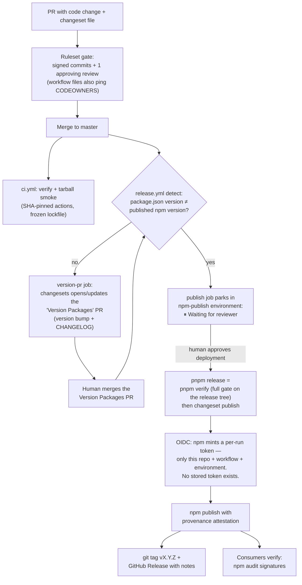

# How this package is published: supply-chain reasoning and setup

This is the reference for `viem-tx-sim`'s npm publishing pipeline: why it exists in this shape, what each layer defends against, what an attacker would actually have to pull off today, what package consumers should do on their side, and a step-by-step playbook for applying the same setup to a package that currently publishes to npm by hand.

Everything described here is in the repo: `.github/workflows/release.yml`, `.github/workflows/ci.yml`, `.github/dependabot.yml`, `.github/CODEOWNERS`, `pnpm-workspace.yaml`, `package.json`, and the GitHub repo settings (ruleset + `npm-publish` environment) recorded below.

---

## 1. Background: how the npm supply chain gets abused

The npm attack surface is not hypothetical. Every mechanism this pipeline defends against has been exploited in a well-documented incident:

| Vector | Incident(s) | What happened |
|---|---|---|
| **Stolen / reused publish credentials** | `eslint-scope` (2018) — [case file](#a1-eslint-scope-2018); Ledger `connect-kit` (2023) — [case file](#a4-ledger-connect-kit-2023) | One credential is enough to publish silently, with no repo access at all. `eslint-scope`: a maintainer's password reused from a third-party breach, on an account without 2FA — the payload then stole *more* npm tokens from installers. Ledger: a *former* employee's never-revoked npm access, with a long-lived API key that bypassed 2FA. |
| **Phished maintainer accounts** | `@solana/web3.js` (Dec 2024) — [case file](#a5-solanaweb3js-2024); `ua-parser-js` (2021) — [case file](#a3-ua-parser-js-2021); the `chalk`/`debug` wave (Sept 2025) — [notes](#b-reported-but-not-re-verified-incidents) | Fake npm emails capture credentials — and in the solana case a *real-time relay* captured a live TOTP code too, defeating conventional 2FA. Attackers published key-stealing versions of packages with millions-to-billions of weekly downloads. |
| **Malicious install scripts & worms** | `eslint-scope`'s `postinstall` payload (2018) — [case file](#a1-eslint-scope-2018); Shai-Hulud worm (Sept & Nov 2025) — [notes](#b-reported-but-not-re-verified-incidents) | `postinstall` runs arbitrary code on every `npm install`. Shai-Hulud used it to steal npm tokens and cloud credentials from developer machines and CI, then *republished itself* into every package the stolen tokens could publish — self-replicating across two waves. |
| **Mutable CI action tags** | `tj-actions/changed-files` (March 2025) — [notes](#b-reported-but-not-re-verified-incidents) | A GitHub Action's version *tags* were repointed at malicious commits. Every workflow referencing `@v4` instead of a commit SHA picked up the payload automatically; CI secrets were exfiltrated at ecosystem scale. |
| **Maintainership handoff / sabotage** | `event-stream` (2018) — [case file](#a2-event-stream--flatmap-stream-2018); `node-ipc`, `colors`/`faker` (2022) — [notes](#b-reported-but-not-re-verified-incidents) | A dependency turns malicious via social-engineered handoff of *legitimate* publish rights, or the real maintainer sabotages it. Note: event-stream's payload was **runtime code, not an install script** — blocking install scripts does not touch this class. |
| **No artifact ↔ source linkage** | generic | Without provenance, nothing proves an npm tarball was built from the repo it claims. A tampered tarball is indistinguishable from a legitimate one. |

(Case-file links go to the [appendix](#appendix-incident-case-files); "case file" entries survived a 3-vote adversarial verification pass against primary sources, "notes" entries are widely reported but were not independently re-verified.)

Two patterns repeat across all of these:

1. **A single credential was sufficient.** One token, one password, one tag pointer — and the blast radius was every downstream installer.
2. **Speed mattered.** Compromised versions are typically detected and unpublished within hours. Anyone who installed during that window lost; anyone whose tooling waited a few days never saw the malicious version.

## 2. The mitigation menu

Each vector has a countermeasure. None is sufficient alone; the point of the design is that they compose:

- **Eliminate long-lived publish credentials** → OIDC *Trusted Publishing*: npm mints a short-lived token per workflow run, only for a pre-registered repo + workflow + environment. There is no token to steal.
- **Prove artifact provenance** → npm provenance attestations (Sigstore): the published tarball is cryptographically linked to the exact commit and workflow run that built it. Consumers can verify.
- **Put a human between "code merged" and "code published"** → GitHub Environments with a required reviewer: publishing parks until a person approves, even if everything upstream was automated.
- **Make CI inputs immutable** → pin every action to a 40-character commit SHA (tags can be moved; SHAs cannot), and verify the SHA against the upstream tag when bumping.
- **Neuter install-time code execution** → package managers that block lifecycle scripts by default, with an explicit per-package allowlist.
- **Outwait the compromise window** → a minimum release age (cooldown) on dependency updates, so versions that get unpublished within hours never reach your tree.
- **Make every change reviewed and attributable** → branch rulesets (PRs + approvals + signed commits), CODEOWNERS on the workflow files themselves, frozen lockfiles so dependency changes are visible diffs.

## 3. Defence in depth: what this repo actually does

Layered from "getting bad code into the repo" through "getting it published" to "consumers installing it":

### Repo / change control

| Control | Where | What it does |
|---|---|---|
| Master ruleset: PR required, 1 approving review, signed commits, no force-push/deletion | GitHub repo ruleset `master` | No direct pushes; every change is a reviewed, signed, attributable PR. |
| CODEOWNERS on `/.github/workflows/` and `/.changeset/config.json` | `.github/CODEOWNERS` | The publish pipeline's own definition is flagged to the owner on every PR touching it. (Code-owner review is deliberately *not* required while the repo has a single maintainer — GitHub forbids self-approval, so the sole owner would deadlock their own workflow changes. Documented in `CLAUDE.md`; enable it when a second maintainer exists.) |
| Weekly Dependabot for GitHub Actions, monthly for npm | `.github/dependabot.yml` | Pin bumps arrive as reviewable PRs instead of silent drift. |

### CI integrity

| Control | Where | What it does |
|---|---|---|
| All actions pinned to full commit SHAs with version comments; zero `@vN` refs | `ci.yml`, `release.yml` | Immune to the tag-repointing attack class (`tj-actions`). When Dependabot bumps a pin, the SHA is verified against the upstream tag (`git ls-remote <repo> refs/tags/<version>`) at review. |
| `permissions: contents: read` at workflow top level; write scopes granted per-job only | both workflows | A compromised step in the verify job cannot write to the repo or mint OIDC tokens. |
| Lockstep pins (node version, Foundry nightly, action SHAs) between `ci.yml` and `release.yml` | comments in both files | What CI verified is what the release runs — no version skew between test and publish environments. |
| `pnpm install --frozen-lockfile` everywhere in CI | both workflows | Dependency resolution cannot drift from the reviewed lockfile. |
| Generated-artifact freshness gate (`git diff --exit-code -- src/generated`) | `ci.yml` | The committed contract bytecode must match what the pinned toolchain regenerates — hand-edits or stale artifacts fail CI. |
| Packed-tarball smoke test with `npm install --ignore-scripts` and exact version pins | `ci.yml` | Verifies the actual publishable artifact (exports, types, runtime import) without executing any dependency's install scripts. |

### The publish path itself

| Control | Where | What it does |
|---|---|---|
| **OIDC Trusted Publishing — no npm token exists anywhere** | npm package settings ↔ `release.yml` | npm only accepts publishes from this exact repo + workflow file + environment. `id-token: write` is granted to the publish job alone. There is no `NPM_TOKEN` secret to steal, and a phished CI cannot publish from anywhere else. |
| **Provenance attestation** | `NPM_CONFIG_PROVENANCE: "true"` in the publish step | Every published version carries a Sigstore attestation binding it to the commit and workflow run. `npm audit signatures` verifies it downstream. |
| **Two-phase, human-gated release** | changesets + `npm-publish` GitHub Environment | Phase 1: merging changesets to master only opens/updates a bot "Version Packages" PR. Phase 2: merging *that* PR triggers the publish job, which **parks in Waiting** until the required reviewer approves the deployment. Malicious code reaching master still cannot reach npm without a human clicking approve. The environment is restricted to master. |
| `detect` job: publish only runs when `package.json` version ≠ published version | `release.yml` | Ordinary pushes never prompt for deployment approval — no approval fatigue, so the prompt stays meaningful. |
| Fork guard (`if: github.repository == 'frontier159/viem-tx-sim'`) | all jobs | Forks can't run the release jobs against their own settings. |
| `pnpm release` = `pnpm verify && pnpm changeset publish` | `package.json` | The full gate (lint, typecheck, build, test suite against real Anvil) runs *inside the publish job*, on the exact tree being published. |
| Automatic `vX.Y.Z` tag + GitHub Release on publish | changesets/action | Every published version has an auditable, immutable anchor in git history with its changelog. |

### Consumption side (this repo as a dependency consumer)

| Control | Where | What it does |
|---|---|---|
| Install scripts blocked by default; single explicit grant (`esbuild`) | pnpm 10 default + `package.json` `onlyBuiltDependencies` | A malicious `postinstall` in any dependency simply does not run — the Shai-Hulud propagation mechanism is inert here. |
| `minimumReleaseAge: 4320` (3 days) with a documented exclusion escape hatch | `pnpm-workspace.yaml` | Freshly published versions can't enter the tree for 3 days. Compromised releases are typically unpublished within hours, so the cooldown outwaits nearly all of them. Urgent security bumps go through `minimumReleaseAgeExclude`. |
| Lockfile-pinned dev tooling; no `pnpm dlx`/`npx` of unpinned tools in workflows | lockfile + workflows | No "run the latest version of X from the network" anywhere in CI. |

### The end-to-end release flow

How the layers above compose into one pipeline, from a code change to a published version:



Two human decisions sit on the only path to npm — merging the Version Packages PR and approving the deployment — and the `detect` guard means ordinary merges never trigger the approval prompt, so it stays rare enough to be read rather than reflex-clicked.

## 4. The attacker's flow now

Goal: get malicious code into a published `viem-tx-sim` version that consumers install.

**Path A — steal a publish credential.** Dead end. There is no npm token in CI secrets, in dotfiles, or anywhere else; trusted publishing mints per-run tokens that only work from `release.yml` in this repo in the `npm-publish` environment.

**Path B — publish from somewhere else with a compromised npm account.** The npm account itself remains a touchpoint: an attacker holding it could re-add a classic token or re-bind the trusted publisher. This is mitigated (npm 2FA, publishing restricted to trusted publisher) but not eliminated — **the npm account and its 2FA are one of the two crown jewels.** Even then, a rogue version published this way would carry *no provenance attestation*, which `npm audit signatures` and provenance-checking consumers would flag.

**Path C — get malicious code through the front door.** The attacker needs *all* of:
1. **Code onto master** — requires a PR with a signed commit and an approving review (ruleset), i.e. compromise of the maintainer's GitHub account + 2FA, not just any credential. Workflow-file changes additionally ping CODEOWNERS.
2. **A version bump** — the `detect` job won't publish without one, so the attacker must also land a changeset and get the bot's Version Packages PR merged (another reviewed merge).
3. **A deployment approval** — the publish job parks until the required reviewer approves it in the GitHub UI.

Every step is the *same* human (or, with a second maintainer, two humans) — so path C collapses to "fully compromise the maintainer's GitHub account with 2FA, and have them not notice a Version Packages PR merge plus an unexpected deployment-approval prompt." That's the second crown jewel. Compare with the pre-hardening world, where one leaked automation token published silently.

**Path D — poison an input.**
- *A pinned GitHub Action*: repointing a tag does nothing (SHA pins); a malicious *new* SHA only enters via a reviewed Dependabot PR where the SHA is checked against the upstream tag.
- *A dependency*: its install scripts won't run (pnpm block), it can't enter for 3 days after publication (cooldown), and it only enters at all via a reviewed lockfile diff (frozen lockfile). A malicious dependency that survives all that and executes at *build* time inside the publish job remains the deepest residual risk — mitigated by the small, pinned dependency tree and the verify gate, not eliminated.
- *The Foundry nightly binary*: pinned to an exact nightly SHA in both workflows; a compromise of foundry's release artifacts is a genuine upstream residual, shared with everyone who uses the toolchain.

**Honest residuals**, in order of concern: maintainer GitHub account takeover (Path C), npm account takeover (Path B), build-time execution by a future compromised dependency (Path D), upstream toolchain artifacts (Path D). Every one of them now requires targeting *this project specifically* rather than harvesting credentials at scale — which is the practical bar most supply-chain attacks fail.

### Cross-check against the verified incident record

We ran the ten defences above against the adversarially verified incident history (see [appendix](#appendix-incident-case-files)). Result: four of the five verified incidents (eslint-scope, ua-parser-js, Ledger, solana) are credential-class compromises this setup addresses head-on — OIDC trusted publishing removes the stealable credential in all four, and the short detection windows (80 minutes to ~5 hours) sit comfortably inside our 3-day consumer cooldown. Two structural gaps survive the cross-check, and it's worth being explicit that they are *class* gaps, not configuration mistakes:

1. **Maintainership handoff / insider sabotage (the event-stream class).** None of the ten defences stops an attacker who *legitimately holds* publish rights, and event-stream's targeted payload stayed hidden ~7–8 weeks — beyond any realistic cooldown. Our exposure as a *publisher* is minimal (single maintainer, no handoff), and as a *consumer* it is one runtime dependency (`viem`) whose updates only enter via reviewed lockfile diffs after the cooldown. The defences that address this class live outside this list: behavioural release-diffing (Socket, OSSF tooling) and treating any dependency maintainership transfer as a review event.
2. **Runtime-CDN "load latest" distribution (the Ledger class).** When consumers load a script from a CDN at page load, every consumer-side defence (lockfiles, cooldowns, pinning) is void. Not applicable to this package — we ship via the registry only, no loader — but consumers embedding *any* library from a CDN should pin exact versions with SRI hashes rather than loading latest.

One verified lesson upgrades a recommendation above: the solana incident defeated **TOTP** 2FA with a real-time phishing relay. The crown-jewel accounts (maintainer GitHub, npm) should use **phishing-resistant second factors (WebAuthn/passkeys)**, not TOTP codes that can be relayed.

## 5. What package consumers should do, by package manager

Independent of anything we do, installers of `viem-tx-sim` (or any package) can protect themselves:

**Everyone, regardless of package manager:**
- Commit and enforce a lockfile; install frozen in CI.
- Verify provenance: `npm audit signatures` (works against any registry client's `node_modules`) — this package publishes attestations, so a version without one is a red flag.
- Don't auto-merge dependency updates the day they're published; give them a cooldown.

**npm:**
- `npm ci` in CI (never bare `npm install`).
- `npm config set ignore-scripts true` globally, then allowlist consciously per-project (note: some packages genuinely need scripts; test after enabling).
- `npm audit signatures` in CI to verify registry signatures + provenance attestations.
- npm has no native release-age cooldown — approximate it with Dependabot's `cooldown` option or Renovate's `minimumReleaseAge`.

**pnpm (what this repo uses):**
- pnpm 10+ blocks dependency lifecycle scripts by default; grant per-package via `onlyBuiltDependencies` only when something truly needs a build step.
- Set `minimumReleaseAge` (e.g. `4320` = 3 days) in `pnpm-workspace.yaml`; keep `minimumReleaseAgeExclude` as the urgent-patch escape hatch.
- `pnpm install --frozen-lockfile` in CI.

**bun:**
- Lifecycle scripts of dependencies don't run unless listed in `trustedDependencies` — keep that list minimal.
- Commit `bun.lock`; `bun install --frozen-lockfile` in CI.
- Recent bun versions support a `minimumReleaseAge` install setting (added in the wake of the 2025 worm incidents) — enable it if your version has it, otherwise cooldown via your update bot.

**yarn (berry):**
- `enableScripts: false` in `.yarnrc.yml`, with `dependenciesMeta[pkg].built: true` as the per-package allowlist.
- Yarn verifies package checksums against the lockfile by default; run `yarn install --immutable` in CI.
- Cooldown via your update bot (Renovate `minimumReleaseAge`).

## 6. Playbook: migrating a manually-published package to this setup

Assumes: a GitHub repo, an existing npm package published by hand with `npm publish`, Node 20+. Order matters in a few places — noted inline.

### Step 1 — Changesets (release automation substrate)

```sh
pnpm add -D @changesets/cli
pnpm changeset init
```

In `.changeset/config.json`: set `"access": "public"` and `"baseBranch"` to your default branch. From now on every behavior-changing PR includes a changeset file (`pnpm changeset`).

### Step 2 — The release workflow

Create `.github/workflows/release.yml` with three jobs (this repo's file is the full reference):

- **`detect`** — compares `package.json` version against `npm view <pkg> version`; outputs `publish=true/false`. This keeps the human approval prompt rare and meaningful.
- **`version-pr`** — runs `changesets/action` with no `publish` input: it opens/updates the "Version Packages" PR whenever changesets exist on the default branch.
- **`publish`** — `needs: detect`, `if: publish == 'true'`, `environment: npm-publish`, `permissions: { contents: write, id-token: write }`; runs `changesets/action` with `publish: pnpm release` and `NPM_CONFIG_PROVENANCE: "true"`.

Add to every job: `if: github.repository == '<owner>/<repo>'` (fork guard). Add `permissions: contents: read` at the workflow top level. Define `"release": "npm run verify && changeset publish"` (or your equivalent full gate) in `package.json` — the publish job should re-verify the exact tree it publishes.

### Step 3 — Pin the actions

Replace every `uses: owner/action@vN` with the full 40-char commit SHA plus a `# vN.N.N` comment. Get the SHA with:

```sh
git ls-remote https://github.com/<owner>/<action> refs/tags/<version>
```

Add `.github/dependabot.yml` with a weekly `github-actions` ecosystem entry so pins don't rot.

### Step 4 — The gated environment (do this before touching npm)

GitHub repo → Settings → Environments → new environment `npm-publish`:
- **Required reviewers**: yourself (and any co-maintainer).
- **Deployment branches**: selected branches → your default branch only.

### Step 5 — npm Trusted Publishing (sequencing matters)

On npmjs.com, package → Settings:
1. Ensure your npm account has 2FA on a real authenticator.
2. **Trusted Publisher** → GitHub Actions → fill in: organization/user, repository, workflow filename (`release.yml`), environment (`npm-publish`). Save this binding **last**, after the workflow and environment exist — the binding is what turns publishing on.
3. Delete every existing npm automation/publish token (check CI secrets, `.npmrc` files, password managers). After this step there is nothing to steal.
4. Set publishing access to require 2FA *or* trusted publisher (i.e., disallow tokenless/classic-token publishes).

### Step 6 — Branch protection

Repo → Settings → Rules → new branch ruleset for the default branch: require PRs with ≥1 approving review, require signed commits, block force pushes and deletions. Add a `.github/CODEOWNERS` entry for `/.github/workflows/` (and `.changeset/config.json`) so pipeline changes ping the owner. **Caveat:** don't enable "require code owner review" while the repo has a single maintainer — GitHub forbids self-approval, so the sole owner blocks their own workflow changes.

### Step 7 — Consumption hardening (defense for your own build)

- Use pnpm 10+ (or configure your PM equivalently): dependency install scripts blocked by default; allowlist only what genuinely needs to build (`onlyBuiltDependencies`).
- `pnpm-workspace.yaml`: `minimumReleaseAge: 4320` (+ documented `minimumReleaseAgeExclude` escape hatch).
- CI installs with `--frozen-lockfile`; no unpinned `npx`/`dlx` in workflows.

### Step 8 — CI parity gates (optional but cheap)

In `ci.yml`: run the same full verify as the publish job; add a packed-tarball smoke test (`pnpm pack`, install the tarball into a temp project with `--ignore-scripts`, import it, typecheck against it); for TS packages add `attw --pack`. If you commit generated artifacts, gate their freshness with `git diff --exit-code -- <generated dir>`.

### Step 9 — First gated release

Land a small changeset, merge the Version Packages PR, and expect the publish job to park in **Waiting** — approve it under Actions → run → "Review deployments". Then verify the result like a consumer:

```sh
npm view <pkg> version
npm audit signatures        # in a project that installed it
```

Confirm the `vX.Y.Z` tag and GitHub Release appeared. Keep this first release small — it's the one that proves the pipeline.

---

## Appendix: incident case files

Sections A1–A5 were fact-checked by a multi-source research pass with 3-vote adversarial verification per claim (25/25 claims survived; votes noted where a claim passed 2-1 on a nuance). Section B collects incidents that are widely reported by reputable sources but did **not** go through that verification pass — treat their details as reported, not confirmed.

### A1. eslint-scope (2018)

- **Date / packages**: July 12, 2018 — `eslint-scope@3.7.2`, `eslint-config-eslint@5.0.2`.
- **Mechanism**: credential reuse. The maintainer had reused their npm password on other sites (one of which was breached) and had no 2FA; the attacker logged in and generated a publish token. *(3-0)*
- **Payload**: a `postinstall` script that fetched and `eval`'d code from pastebin.com, exfiltrating the installer's `.npmrc` npm auth token to two remote servers — stealing publish credentials from everyone who installed it. *(3-0)*
- **Detection / remediation**: user GitHub report at 11:17 UTC → npm unpublished 12:37 UTC (~80 minutes exposure) → npm revoked **all** pre-incident tokens at 18:42 UTC; clean 3.7.3 republished. *(3-0)*
- **Defences that would have worked**: 2FA (directly), OIDC trusted publishing (nothing to steal or reuse), blocked install scripts (payload never runs), a cooldown ≥ a few hours (detection at 80 minutes).
- **Sources**: [ESLint postmortem](https://eslint.org/blog/2018/07/postmortem-for-malicious-package-publishes/) · [GHSA-hxxf-q3w9-4xgw](https://github.com/advisories/GHSA-hxxf-q3w9-4xgw)

### A2. event-stream / flatmap-stream (2018)

- **Date / packages**: dependency added Sept 9, 2018 (`event-stream@3.3.6` → `flatmap-stream`); payload weaponized in `flatmap-stream@0.1.1` ~Oct 5; npm notified Nov 26 — a ~7–8-week weaponized window inside a 2.5-month dependency window. *(3-0; timeline nuance 2-1)*
- **Mechanism**: social-engineered **maintainership handoff** — the attacker (`right9ctrl`) was *given* legitimate publish rights by the original maintainer. No credential was stolen. *(3-0)*
- **Payload**: encrypted, highly targeted **runtime** code (not an install script) that harvested private keys only from Copay wallet users with balances >100 BTC / >1000 BCH; Copay releases 5.0.2–5.1.0 shipped it. *(3-0)*
- **Remediation**: npm removed both packages and took ownership of `event-stream`.
- **Defence gap (verified)**: none of the ten defences in this report stops this class — the publisher was legitimate, provenance would have attested the malicious build faithfully, install-script blocking doesn't apply to runtime payloads, and the stealth window outlasted any plausible cooldown. Frozen lockfiles only delay exposure. Countermeasures live elsewhere: behavioural release-diffing and treating maintainership transfer as a trust event.
- **Sources**: [npm postmortem](https://blog.npmjs.org/post/180565383195/details-about-the-event-stream-incident)

### A3. ua-parser-js (2021)

- **Date / packages**: Oct 22, 2021 — malicious `0.7.29`, `0.8.0`, `1.0.0` published simultaneously across all three active release lines of a ~7M-weekly-download package (consistent with account takeover; confirmed by the maintainer and npm's "hijacked" deprecation notice). *(3-0; takeover inference 2-1, independently confirmed)*
- **Payload**: Monero cryptominer plus the DanaBot credential stealer, delivered via `preinstall`; CISA's same-day alert assessed impact up to full system takeover. *(3-0)*
- **Remediation**: patched `0.7.30` / `0.8.1` / `1.0.1` the same day.
- **Defences that would have worked**: 2FA / OIDC (account-takeover vector), blocked install scripts (`preinstall` payload), same-day detection inside any cooldown, provenance (no matching repo commits existed).
- **Sources**: [CISA alert](https://www.cisa.gov/news-events/alerts/2021/10/22/malware-discovered-popular-npm-package-ua-parser-js) · [GHSA-pjwm-rvh2-c87w](https://github.com/advisories/GHSA-pjwm-rvh2-c87w)

### A4. Ledger Connect Kit (2023)

- **Date / packages**: Dec 14, 2023 — `@ledgerhq/connect-kit` `1.1.5`–`1.1.7`.
- **Mechanism**: a **former** employee was phished; their npm access had never been revoked at offboarding, and a long-lived API key tied to the account **bypassed 2FA** entirely. *(3-0)*
- **Amplifier**: dApps loaded the *latest* Connect Kit from a CDN at page load (`connect-kit-loader`), so the malicious publish propagated instantly to live sites with zero downstream code change — affected dApps never redeployed anything.
- **Payload**: the Angel Drainer wallet drainer (approval/permit signing tricks); ~$484–600K drained in under 2 hours of active draining. Ledger shipped a fix within 40 minutes of awareness, but CDN caching kept the malicious code reachable ~5 hours. *(3-0)*
- **Defences that would have worked**: token/access revocation at offboarding, OIDC trusted publishing (no long-lived key to phish around 2FA), human-gated deploy environments. **Verified partial gap**: the CDN load-latest model voids every consumer-side defence — the fix is version-pinned CDN URLs with SRI, or not distributing that way at all.
- **Sources**: [Ledger incident report](https://www.ledger.com/blog/security-incident-report)

### A5. @solana/web3.js (2024)

- **Date / packages**: Dec 3, 2024 — `1.95.6` (15:10 UTC) and `1.95.7` (15:20 UTC); ~5 hours live before unpublishing; `1.95.8` clean. *(3-0)*
- **Mechanism**: spear-phishing spoofing a teammate led a developer with publish rights to a fake npm site that captured username, password, **and a live TOTP code via real-time relay — 2FA was present and defeated**. *(3-0)*
- **Payload**: exfiltration injected into five key-handling methods (`new Account()`, `Keypair.fromSecretKey()`, `Keypair.fromSeed()`, and the two `createInstructionWithPrivateKey` program helpers), sending private keys to an attacker server — draining bots and backend dApps that held raw keys. *(3-0)*
- **Defences that would have worked**: phishing-resistant WebAuthn (TOTP was not enough), OIDC trusted publishing (nothing phishable grants publish), provenance attestations, and any cooldown ≥1 day (5-hour window).
- **Sources**: [Anza root-cause analysis](https://www.anza.xyz/blog/web3-js-exploit-root-cause-analysis) · [GHSA-jcxm-7wvp-g6p5](https://github.com/solana-labs/solana-web3.js/security/advisories/GHSA-jcxm-7wvp-g6p5)

### B. Reported but not re-verified incidents

These did not pass through the adversarial verification pass (their claims either weren't ranked into the verification budget or lack a single authoritative postmortem); sources are reputable but details here are *as reported*:

- **Shai-Hulud worm, waves 1 & 2 (Sept & Nov 2025)** — self-replicating npm worm: phishing (spoofed npm MFA-update emails) seeded maintainer-account compromises; lifecycle-script payloads stole npm tokens and cloud credentials, then republished the worm into every package reachable with stolen tokens. The second wave was reported at ~796 packages / 1,092 versions / 20M+ combined weekly downloads. Blocked install scripts and OIDC publishing directly attack its propagation loop. [CISA alert (Sept 2025)](https://www.cisa.gov/news-events/alerts/2025/09/23/widespread-supply-chain-compromise-impacting-npm-ecosystem) · [Unit 42](https://unit42.paloaltonetworks.com/npm-supply-chain-attack/) · [Datadog on wave 2](https://securitylabs.datadoghq.com/articles/shai-hulud-2.0-npm-worm/)
- **chalk/debug ("qix") phishing wave (Sept 2025)** — one maintainer phished; 18+ foundational packages with ~2B combined weekly downloads briefly shipped a browser crypto-clipper. [Aikido](https://www.aikido.dev/blog/npm-debug-and-chalk-packages-compromised) · [Wiz](https://www.wiz.io/blog/widespread-npm-supply-chain-attack-breaking-down-impact-scope-across-debug-chalk)
- **tj-actions/changed-files + reviewdog (March 2025)** — GitHub Action version tags repointed at a malicious commit (seeded via a compromised contributor token in `reviewdog/action-setup`, CVE-2025-30154 → CVE-2025-30066); CI secrets dumped from workflows across tens of thousands of repos. SHA-pinning is the direct defence. [CISA alert](https://www.cisa.gov/news-events/alerts/2025/03/18/supply-chain-compromise-third-party-tj-actionschanged-files-cve-2025-30066-and-reviewdogaction) · [Unit 42](https://unit42.paloaltonetworks.com/github-actions-supply-chain-attack/) · [Wiz](https://www.wiz.io/blog/new-github-action-supply-chain-attack-reviewdog-action-setup)
- **coa & rc (Nov 2021)** — hijacked developer account pushed credential-stealing versions of two packages with ~23M combined weekly downloads. [The Record](https://therecord.media/malware-found-in-coa-and-rc-two-npm-packages-with-23m-weekly-downloads)
- **colors/faker & node-ipc protestware (2022)** — the *legitimate* maintainers sabotaged their own packages (infinite loops; geo-targeted file overwrites). Same defence profile as the event-stream class: publisher-side controls don't apply; cooldowns, lockfile review, and behavioural diffing are the consumer's tools.

---

*Written 2026-07-11 against `viem-tx-sim` at the `v0.2.2` release (the first release through the fully gated pipeline). The setup was built across plans 028–030 (npm readiness, release automation, supply-chain hardening) and 037 (environment-gated publishing) in `plans/`. Incident facts in sections A1–A5 were verified by a 25-source research pass with 3-vote adversarial verification per claim (2026-07-11); section B is reported-but-not-re-verified.*
